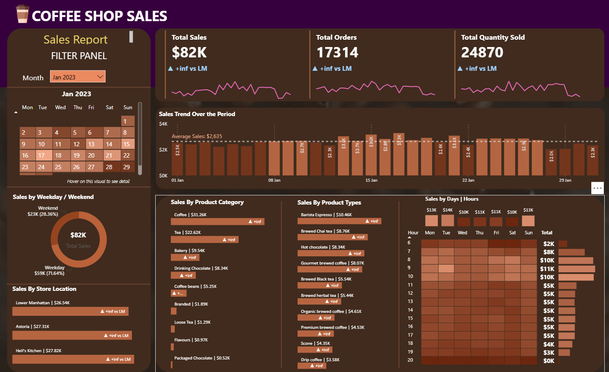

# ☕ Coffee Sales Report – Power BI Dashboard

## 📊 Project Overview

The **Coffee Sales Report** is an interactive **Power BI dashboard** designed to analyze coffee sales performance and identify important business insights.

The dashboard provides a clear overview of sales, revenue, product performance, customer behavior, and sales trends using interactive visualizations and filters.

This project demonstrates how **Power BI, data cleaning, data modeling, DAX, and data visualization** can be used to transform raw coffee sales data into meaningful business insights.

---

## 🎯 Project Objectives

The main objectives of this project are:

* Analyze overall coffee sales performance.
* Track total sales and revenue.
* Identify the best-performing coffee products.
* Analyze sales trends over time.
* Compare sales performance across different categories.
* Understand customer purchasing patterns.
* Identify high-performing products and periods.
* Create an interactive and user-friendly business dashboard.
* Present data-driven insights for better decision-making.

---

## 🛠️ Tools & Technologies

* **Power BI**
* **Power Query**
* **DAX**
* **Microsoft Excel / CSV**
* **Data Cleaning & Transformation**
* **Data Visualization**
* **Data Analysis**

---
## 📌 Dashboard Features

The Power BI dashboard includes interactive analysis such as:

### 💰 Sales Analysis

* Total Sales
* Total Revenue
* Sales performance over time
* Monthly and daily sales trends

### ☕ Product Analysis

* Best-selling coffee products
* Product-wise sales comparison
* Category-wise performance
* Product contribution to total sales

### 📅 Time-Based Analysis

* Daily sales trends
* Monthly sales trends
* Yearly performance comparison
* Identification of high and low sales periods

### 📊 Interactive Filters

Users can interact with the dashboard using filters/slicers such as:

* Date
* Product
* Coffee Type
* Category
* Other available business dimensions

---

## 📈 Key Performance Indicators (KPIs)

The dashboard focuses on important business KPIs such as:

| KPI           | Description                               |
| ------------- | ----------------------------------------- |
| Total Sales   | Overall sales generated                   |
| Total Revenue | Total revenue generated from coffee sales |
| Total Orders  | Number of orders/transactions             |
| Average Sales | Average sales value                       |
| Top Product   | Highest-performing coffee product         |
| Sales Trend   | Sales performance over time               |

---

## 🔄 Data Preparation

The raw data was processed using **Power Query** before visualization.

The data preparation process included:

1. Importing the raw coffee sales dataset.
2. Checking column names and data types.
3. Handling missing or inconsistent values.
4. Removing unnecessary columns.
5. Creating calculated columns where required.
6. Formatting date and numerical fields.
7. Preparing the dataset for analysis.
8. Loading the cleaned data into Power BI.

---

## 🧮 DAX

DAX measures were created to calculate important business metrics and KPIs.

Example:

```DAX
Total Sales = SUM(Sales[Sales])
```

```DAX
Total Orders = DISTINCTCOUNT(Sales[Order_ID])
```

Additional measures can be created according to the available columns and business requirements.

---

## 📊 Data Visualization

The dashboard uses different Power BI visualizations to make the analysis easier to understand, including:

* KPI Cards
* Bar Charts
* Column Charts
* Line Charts
* Donut/Pie Charts
* Tables
* Slicers
* Interactive filters

These visualizations allow users to quickly identify sales patterns and product performance.

---

## 💡 Business Insights

The dashboard can help answer questions such as:

* Which coffee product generates the highest sales?
* Which month has the highest sales?
* Which products contribute most to overall revenue?
* What are the sales trends over time?
* Which category performs better?
* When does the business experience peak sales?
* Which products may require additional marketing?
* How does sales performance change across different periods?

---

## 🚀 How to Use

### 1. Clone the Repository

```bash
git clone https://github.com/your-username/Coffee-Sales-Report.git
```

### 2. Open the Project

Open:

```text
Coffee Sales Report.pbix
```

using **Microsoft Power BI Desktop**.

### 3. Refresh the Data

If the dataset is included in the repository:

1. Open Power BI Desktop.
2. Go to **Home → Refresh**.
3. Check the data connections if required.
4. Interact with the dashboard using the available filters.

---

## 📷 Dashboard Preview

Add your dashboard screenshot here:



---

## 🎓 Skills Demonstrated

This project demonstrates practical knowledge of:

* Data Analysis
* Data Cleaning
* Power Query
* DAX
* Data Modeling
* KPI Development
* Business Intelligence
* Data Visualization
* Dashboard Design
* Interactive Reporting
* Business Insights

---

## 👨‍💻 Author

**Abdul Rahman**

Aspiring Data Analyst | Power BI | Python | SQL | Data Visualization

---

## ⭐ Project Purpose

This project was developed as part of my **Data Analytics / Power BI portfolio** to demonstrate the ability to transform raw sales data into an interactive business intelligence dashboard.

If you find this project useful, consider giving the repository a ⭐.
